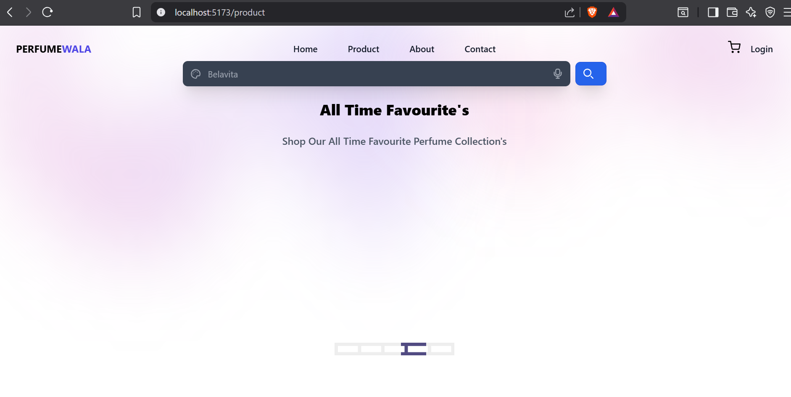
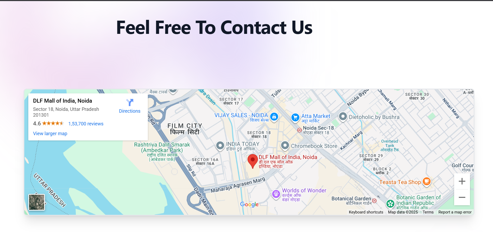
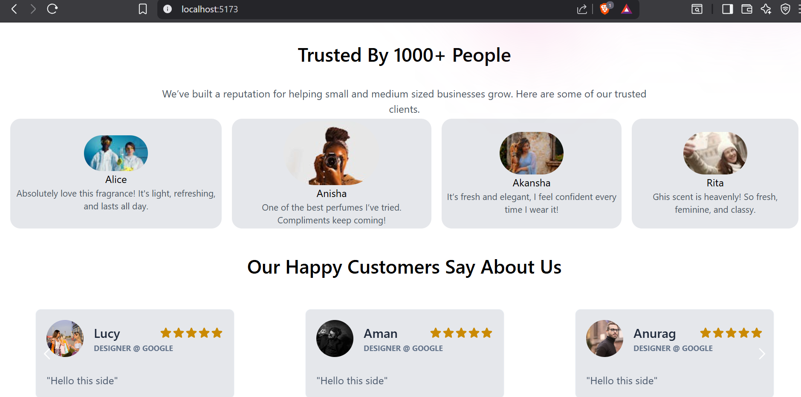

🌸 Perfume Wala

Perfume Wala is an E-commerce web application built with React (frontend) and Node.js + Express + MongoDB (backend).
It is designed to showcase perfumes, allow users to browse collections, and eventually support authentication, cart, and checkout features.

### 🚀 Tech Stack
 🎨 Frontend

⚛️ React 18 + Vite

🎨 TailwindCSS

🛣️ React Router DOM

🔌 Axios (for API calls)

🧩 UI Libraries: Heroicons, Headless UI, React Icons, Carousel, Infinite Scroll

🖥️ Backend

🟢 Node.js + Express

🍃 MongoDB + Mongoose

🔐 Passport.js (authentication)

🔑 Bcrypt.js (password hashing)

📧 Nodemailer (emails)

📜 Express-session + JWT

✨ Current Features (Implemented)

### Static Pages

🏠 Home (/)

ℹ️ About (/about)

📞 Contact (/contact)

🛍️ Collections (/collections)

❌ Error Page (*)

### Basic Frontend Setup

🧭 Navigation with React Router

🎨 TailwindCSS for styling

Backend Setup

🔗 API routes for authentication and products (not yet fully connected to frontend)

📧 Email sending route (/email/sendEmail)

## 🛠️ Planned Features 

User Authentication

📝 Register & 🔑 Login pages (currently not functional due to ProtectedRoute issue)

Secure login with Passport.js + JWT

Product Management

📦 Fetch and display perfumes from MongoDB

🛒 Product detail pages (/singleproduct/:id)

Shopping Cart

➕ Add/remove items from cart

👀 View selected items on /cart

Email Integration

📩 Send confirmation emails for orders/contact forms
---

## ⚡ Getting Started

### 1️⃣ Clone the Repository

git clone <repo-url>
cd EcommPerfume
 
```2️⃣ Setup the Server
cd server
npm install

Create a .env file inside server/ with:
MONGO_URI=your_mongo_connection_string
SECRET_KEY=your_secret_key

Start the backend:
npm start


3️⃣ Setup the Client
cd client
npm install
npm run dev

Client runs on http://localhost:5173

📌 Folder Structure
EcommPerfume/
│
├── 📦 client/                 # React frontend
│   ├── 🗂️ public/              # Static files
│   ├── 📁 src/                 # Main source code
│   │   ├── 🖼️ assets/          # Images & static assets
│   │   ├── 🧩 components/      # Reusable UI components
│   │   ├── 🎨 icons/           # Icon components
│   │   ├── ⏳ loader/          # Loading animations/components
│   │   ├── 📄 pages/           # Static pages (Home, About, Contact, etc.)
│   │   ├── 🔌 reviewApis/      # API integration (planned/under dev)
│   │   ├── ⚛️ App.jsx          # Main app component
│   │   ├── 🏠 Home.jsx         # Homepage
│   │   ├── 🛍️ Product.jsx      # Products listing page
│   │   ├── 📦 SingleProduct.jsx # Single product details page
│   │   ├── 🚀 main.jsx         # React entry point
│   │   └── 🎨 index.css        # Global styles
│   │
│   ├── 📝 index.html           # Root HTML file
│   ├── 🎨 tailwind.config.js   # TailwindCSS config
│   ├── ⚡ vite.config.js       # Vite config
│   └── 📦 package.json         # Frontend dependencies
│
├── 🖥️ server/                  # Node.js + Express backend
│   ├── 🎯 controllers/         # Logic for authentication, email, products
│   ├── 🗄️ models/              # Mongoose models  (⚠️ was "modals", renamed)
│   ├── 🔗 Routes/              # API routes (user, email, product)
│   ├── 🔐 passport-config.js   # Passport.js strategies
│   ├── 🚀 server.js            # Express app entry point
│   ├── ⚙️ .env                 # Environment variables
│   └── 📦 package.json         # Backend dependencies
│
├── ⚙️ .gitignore
└── 📘 README.md

 📸 Screenshots
Home Page

About Page

Product Listing (Static for now)

Contact Page


review page 

last page 

🔮 Future Scope

✅ Fully functional authentication (Login/Register)

📦 Dynamic product catalog connected to MongoDB

🛒 Add to Cart & Checkout flow

🛠️ Admin panel for managing products

🌐 Deployment on Vercel (frontend) & Render/Heroku (backend)